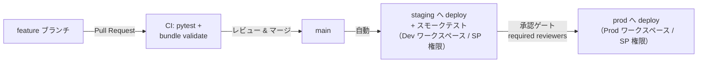

# cicd_lakeflow — DAB + GitHub Actions による Databricks 標準 CI/CD デモ

Databricks Asset Bundles（DAB）と GitHub Actions の**役割分担**を示すための最小デモ。

## 役割分担（このリポジトリの核メッセージ）

| レイヤー | 担当ファイル | 役割 |
|---|---|---|
| Git リポジトリ | リポジトリ全体 | コードと構成の唯一の真実。ブランチ・PR・レビュー |
| CI ツール（GitHub Actions） | `.github/workflows/*.yml` | **いつ・どこへ・誰の権限で** — トリガー、環境の選択、Secrets、承認ゲート |
| DAB | `databricks.yml` + `resources/*.yml` | **何を・どうデプロイするか** — ジョブ定義、環境差分（targets）、デプロイ実行 |
| Databricks | Dev / Prod ワークスペース | 実行環境 |

CI ツールは `databricks bundle validate / deploy / run` を呼ぶだけなので、
**GitHub Actions → Azure DevOps に移行しても DAB 側の定義は変更不要**。

## パイプラインの流れ



| ターゲット | ワークスペース | mode | デプロイ契機 | 実行主体 |
|---|---|---|---|---|
| `dev` | Dev (azurew2) | `development` | 開発者がローカルで `databricks bundle deploy -t dev` | 開発者本人 |
| `staging` | Dev (azurew2) | —（トリガーは PAUSED） | main への push → `CD` の deploy-staging | SP: sp-dab-cicd-deploy |
| `prod` | Prod (azurew1) | `production` | 同じ `CD` run 内で**承認後**に deploy-prod | SP: sp-dab-cicd-deploy |

## ローカルでの開発フロー

```bash
# 認証（プロファイルは各自の設定に合わせる）
export DATABRICKS_CONFIG_PROFILE=azurew2

databricks bundle validate -t dev   # 定義の検証
databricks bundle deploy -t dev     # 自分専用のサンドボックスへデプロイ（[dev <name>] プレフィックス）
databricks bundle run demo_etl_job -t dev

pytest tests -v                     # ユニットテスト
```

## CI/CD の前提設定（インフラ担当者が整備する部分）

- GitHub Environments: `dev` / `production` を作成し、それぞれに
  `DATABRICKS_CLIENT_ID` / `DATABRICKS_CLIENT_SECRET`（デプロイ用 SP の OAuth M2M 資格情報）を登録。
- `production` 環境に **required reviewers（承認ゲート）** を設定 — 本番デプロイ前に人の承認を挟む。
- デプロイ用 SP `sp-dab-cicd-deploy` を各ワークスペースに作成（このデモでは簡略化のため admins 所属。
  実運用では最小権限を設計する）。
- **CIランナーからの経路**: ワークスペースが IP ACL / Private Link で保護されている場合、
  Databricks に到達するジョブ（validate / deploy）は許可ネットワーク上の self-hosted runner
  （Azure DevOps なら self-hosted agent）で実行する。Databricks に依存しないジョブ
  （ユニットテスト等）は hosted runner でよい — 本リポジトリはこのハイブリッド構成。

## Azure DevOps へ移行する場合に変わるもの / 変わらないもの

| | 内容 |
|---|---|
| 変わらない | `databricks.yml`、`resources/`、`src/`、`lib/`、`tests/` — DAB とアプリケーションコードすべて |
| 変わる | `.github/workflows/` → Azure Pipelines YAML、Secrets の置き場所（Variable Groups / Key Vault）、承認ゲートの実装（ADO Environments approvals） |
